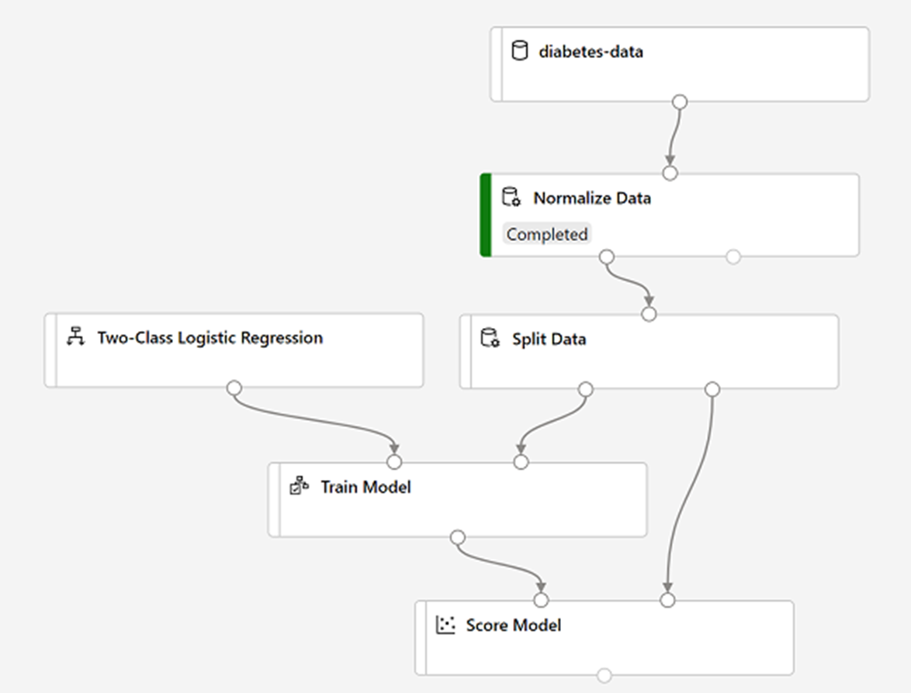
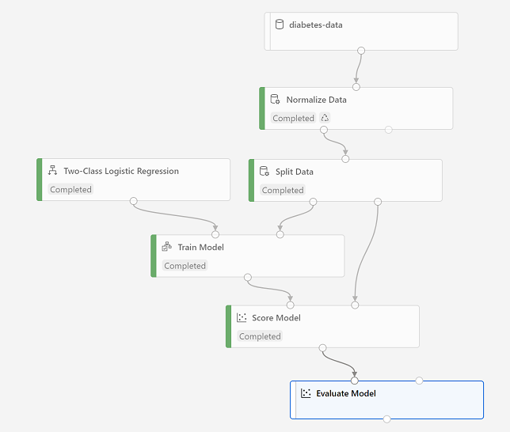

Imagine you are in banking and you are creating an ML model for detecting if transactions are fraudulent or not. 
Is this classification or regression and why?
- Classification, categorical label
- or Binay Classification to be more accurate


classification
-----------

https://chatbotsmagazine.com/design-framework-for-chatbots-aa27060c4ea3

https://chatbotsmagazine.com/contextual-chat-bots-with-tensorflow-4391749d0077

http://playground.tensorflow.org/


- Classification is a form of machine learning that is used to predict which category, or class, an item belongs to. T
- You use Azure Machine Learning designer to create a training pipeline for a classification model. What must you do before deploying the model as a service? Create an inference pipeline from the training pipeline
- A health clinic is planning on using datasets that contain characteristics of patients to predict whether the patient has a risk of diabetes or not. Can this task be accomplished with the help of classification?
- What values/cases does a confusion matrix present?
- What are the two best metrics to assess model classification performance? => Most data scientists use metrics like precision and recall to assess classification model performance.
- Which metric presents the ratio of correct predictions (true positives + true negatives) to the total number of predictions? => Accuracy 
- You use an Azure Machine Learning designer pipeline to train and test a binary classification model. You review the model's performance metrics in an Evaluate Model module, and note that it has an AUC score of 0.6. What can you conclude about the model?
- Which metric presents the fraction of positives cases correctly identified? => Precision
- Which of the following are models that help predict between two or several categories?


Explore Data
-------------

To train a classification model, you need a dataset that includes historical features 
(characteristics of the entity for which you want to make a prediction) and known label values 
(the class indicator that you want to train a model to predict).

Dataset: https://github.com/MicrosoftLearning/mslearn-dp100/blob/main/data/diabetes.csv

```
diabetes-data
|_______________> Normalize data (add transformer)
                  Set the transformation to MinMax and select following columns:
                  Pregnancies
		  TricepsThickness
		  SerumInsulin
		  BMI
		  DiabetesPedigree
		  Age
		  PlasmaGlucose
		  DiastolicBloodPressure
```

The data transformation is normalizing the numeric columns to put them on the same scale, which should help prevent columns with large values from dominating model training. You'd usually apply a whole bunch of pre-processing transformations like this to prepare your data for training

Train model
----

It's common practice to train the model using a subset of the data, while holding back some data with which to test the trained model. This enables you to compare the labels that the model predicts with the actual known labels in the original dataset. 



Evaluate a model
--------

The validation data you held back and used to score the model includes the known values for the label. 
So, to validate the model, you can compare the true values for the label to the label values that 
were predicted when you scored the validation dataset. Based on this comparison, you can calculate 
various metrics that describe how well the model performs. 

View the confusion matrix for the model, which is a tabulation of the predicted and actual value 
counts for each possible class. For a binary classification model like this one, where you're 
predicting one of two possible values, the confusion matrix is a 2x2 grid showing the predicted and 
actual value counts for classes 0 and 1, similar to this: 

The confusion matrix shows cases where both the predicted and actual values were 1 (known as true positives) 
at the top left, and cases where both the predicted and the actual values were 0 (true negatives) at the bottom right. 
The other cells show cases where the predicted and actual values differ (false positives and false negatives). 

Review the metrics to the left of the confusion matrix, which include: 
- Accuracy: The ratio of correct predictions (true positives + true negatives) to the total number of predictions
- Precision: The fraction of positive cases correctly identified
- Recall: The fraction of the cases classified as positive that are actually positive
- F1 Score: An overall metric that essentially combines precision and recall. 
- AUC: AUC ranges in value from 0 to 1. A model whose predictions are 100% wrong has an AUC of 0.0; one whose predictions are 100% correct has an AUC of 1.0.

Of these metrics, accuracy is the most intuitive.
- Above the list of metrics, note that there's a Threshold slider. 
Remember that what a classification model predicts is the probability for each possible class. 
- the predicted probability for a positive (that is, diabetic) prediction is a value between 0 and 1.
- Try moving the threshold slider and observe the effect on the confusion matrix. 
- If you move it all the way to the left (0), the Recall metric becomes 1, and 
- if you move it all the way to the right (1), the Recall metric becomes 0. 




- The performance of this model isn't all that great, partly because we performed only 
minimal feature engineering and pre-processing. You could try a different classification algorithm, 
such as Two-Class Decision Forest, and compare the results.

Inference Pipeline
-------------------

You need a second pipeline that performs the same data transformations for new data, and then uses the trained model to inference  (in other words, predict) label values based on its features. This pipeline will form the basis for a predictive service that you can publish for applications to use. 

```csv
PatientID,Pregnancies,PlasmaGlucose,DiastolicBloodPressure,TricepsThickness,SerumInsulin,BMI,DiabetesPedigree,Age
1882185,9,104,51,7,24,27.36983156,1.350472047,43
1662484,6,73,61,35,24,18.74367404,1.074147566,75
1228510,4,115,50,29,243,34.69215364,0.741159926,59
```

Deploy a predictive service
----------------------------
After you've created and tested an inference pipeline for real-time inferencing, you can publish 
it as a service for client applications to use. 

```python
endpoint = 'YOUR_ENDPOINT' #Replace with your endpoint 
key = 'YOUR_KEY' #Replace with your key 
  
import urllib.request 
import json 
import os 
  
data = { 
    "Inputs": { 
        "WebServiceInput0": 
        [ 
            { 
                    'PatientID': 1882185, 
                    'Pregnancies': 9, 
                    'PlasmaGlucose': 104, 
                    'DiastolicBloodPressure': 51, 
                    'TricepsThickness': 7, 
                    'SerumInsulin': 24, 
                    'BMI': 27.36983156, 
                    'DiabetesPedigree': 1.3504720469999998, 
                    'Age': 43, 
            }, 
        ], 
    }, 
    "GlobalParameters":  { 
    } 
} 
  
body = str.encode(json.dumps(data)) 
  
  
headers = {'Content-Type':'application/json', 'Authorization':('Bearer '+ key)} 
  
req = urllib.request.Request(endpoint, body, headers) 
  
try: 
    response = urllib.request.urlopen(req) 
    result = response.read() 
    json_result = json.loads(result) 
    output = json_result["Results"]["WebServiceOutput0"][0] 
    print('Patient: {}\nPrediction: {}\nProbability: {:.2f}'.format(output["PatientID"], 
                                                            output["DiabetesPrediction"], 
                                                            output["Probability"])) 
except urllib.error.HTTPError as error: 
    print("The request failed with status code: " + str(error.code)) 
  
    # Print the headers to help debug 
    print(error.info()) 
    print(json.loads(error.read().decode("utf8", 'ignore'))) 
```

References
----

- https://docs.microsoft.com/en-us/azure/machine-learning/algorithm-cheat-sheet
