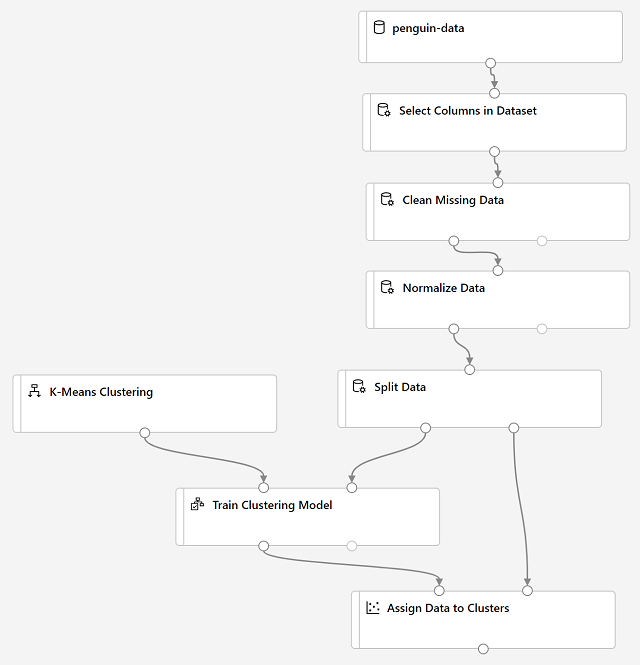
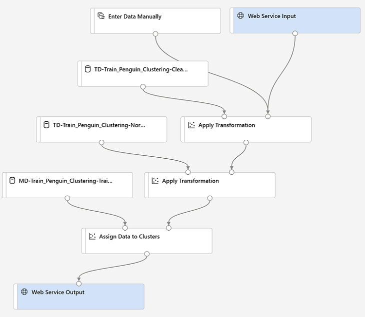

- form of ML that identifies groups based on features of items

- You want to train a model where there is no previously known cluster value (or label) from which to train the model. 
Which type of machine learning would you use?
-Clustering is a form of machine learning that is used to group similar items into clusters based on their predictions. => F
- What type of machine learning technique does clustering examples? => unsupervised
- You create a machine learning experiment based on a clustering model. Now you want to use the model in an inference pipeline. Which module should you use to infer cluster predictions from the model? => Assign Data to Clusters module generates cluster predictions from a trained clustering model
- When using a clustering module, what algorithm let’s you group items into a number of clusters you specify?
- Suppose you are testing a K-Means clustering model. If you would want your model to assign items to one of four clusters, which parameter/property should you configure on the module? => Set number of centroids to 4 
- What is the purpose of a clustering model?
- Which of the following scenarios can be resolved by applying clustering modules/algorithms?
1) A social media company that wants to group similar users based on their posts.
2) A radio company that wants to apply tags (like rock, pop, R&B etc) to songs or artists.
- When evaluating a clustering model, what metrics can you visualize in the Evaluate results section?

- You are building an Azure Machine learning pipeline that involves a clustering module. You need to prepare the data and change some of the numeric values from the dataset to use a common scale, without distorting differences in the ranges of values or losing information. => Normalize Data

- A Hospital Care chain wants to open a series of Emergency-Care wards within a region. The chain knows the location of all the maximum accident-prone areas in the region. They have to decide the number of the Emergency Units to be opened and the location of these Emergency Units, so that all the accident-prone areas are covered in the vicinity of these Emergency Units. 

Which type of machine learning model is best to be applied in this scenario? => Clustering?

EDA
----

https://github.com/MicrosoftDocs/ml-basics/blob/master/data/penguins.csv

```
CulmenLength,CulmenDepth,FlipperLength,BodyMass,Species
39.1,18.7,181,3750,0
39.5,17.4,186,3800,0
40.3,18,195,3250,0
,,,,0
36.7,19.3,193,3450,0
39.3,20.6,190,3650,0
```


Train model
--------------

- The model we're training will use the features to group the data into clusters, 
so we need to train the model using a clustering algorithm: K-Means Clustering 
- K-Means algorithm groups items into the number of clusters you specify - a value referred to as K.
K = 3 in this example
- After using 70% of the data to train the clustering model, you can use the remaining 30% to test it by using the model to assign the data to clusters



Evaluate trained model
--

The performance metrics in each row are: 
- Average Distance to Other Center: how close, on average, each point in the cluster is to the centroids of all other clusters. 
- Average Distance to Cluster Center: how close, on average, each point in the cluster is to the centroid of the cluster. 
- Number of Points: number of points assigned to the cluster
- Maximal Distance to Cluster Center: maximum of the distances between each point and the centroid of that point’s cluster
This statistic in combination with the "Average Distance to Cluster Center" helps you determine the cluster’s spread. 

inference a trained model
-------------------------



```
CulmenLength,CulmenDepth,FlipperLength,BodyMass
39.1,18.7,181,3750
49.1,14.8,220,5150
46.6,17.8,193,3800
```

deploy an inferenced model
---------------------------

```python
endpoint = 'YOUR_ENDPOINT' #Replace with your endpoint
key = 'YOUR_KEY' #Replace with your key

import urllib.request
import json
import os

data = {
    "Inputs": {
        "WebServiceInput0":
        [
            {
                    'CulmenLength': 49.1,
                    'CulmenDepth': 4.8,
                    'FlipperLength': 1220,
                    'BodyMass': 5150,
            },
        ],
    },
    "GlobalParameters":  {
    }
}

body = str.encode(json.dumps(data))


headers = {'Content-Type':'application/json', 'Authorization':('Bearer '+ key)}

req = urllib.request.Request(endpoint, body, headers)

try:
    response = urllib.request.urlopen(req)
    result = response.read()
    json_result = json.loads(result)
    output = json_result["Results"]["WebServiceOutput0"][0]
    print('Cluster: {}'.format(output["Assignments"]))

except urllib.error.HTTPError as error:
    print("The request failed with status code: " + str(error.code))

    # Print the headers to help debug
    print(error.info())
    print(json.loads(error.read().decode("utf8", 'ignore')))
```

