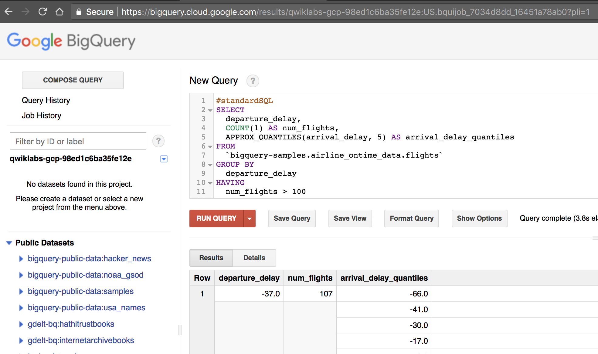
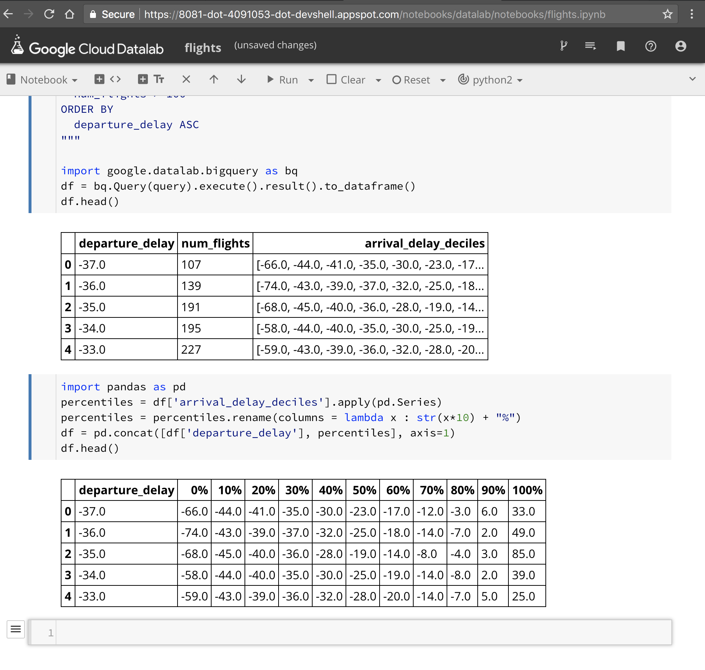

```
datalab create data_analysis_lab --zone us-west1-a
```

BigQuery
-----------

https://bigquery.cloud.google.com/

```
#standardSQL
SELECT
  departure_delay,
  COUNT(1) AS num_flights,
  APPROX_QUANTILES(arrival_delay, 5) AS arrival_delay_quantiles
FROM
  `bigquery-samples.airline_ontime_data.flights`
GROUP BY
  departure_delay
HAVING
  num_flights > 100
ORDER BY
  departure_delay ASC
```




Draw graphs in Jupyter/ Cloud Datalab
----------------------------

- Cloud Datalab provides a managed Jupyter experience 
- get the results from BigQuery as a Pandas dataframe.
- https://pandas.pydata.org/
- pandas provides high-performance, easy-to-use data structures and data analysis tools for the Python PL
- https://medium.com/@chris_bour/6-differences-between-pandas-and-spark-dataframes-1380cec394d2

```
query="""
SELECT
  departure_delay,
  COUNT(1) AS num_flights,
  APPROX_QUANTILES(arrival_delay, 10) AS arrival_delay_deciles
FROM
  `bigquery-samples.airline_ontime_data.flights`
GROUP BY
  departure_delay
HAVING
  num_flights > 100
ORDER BY
  departure_delay ASC
"""

import google.datalab.bigquery as bq
df = bq.Query(query).execute().result().to_dataframe()
df.head()
```




