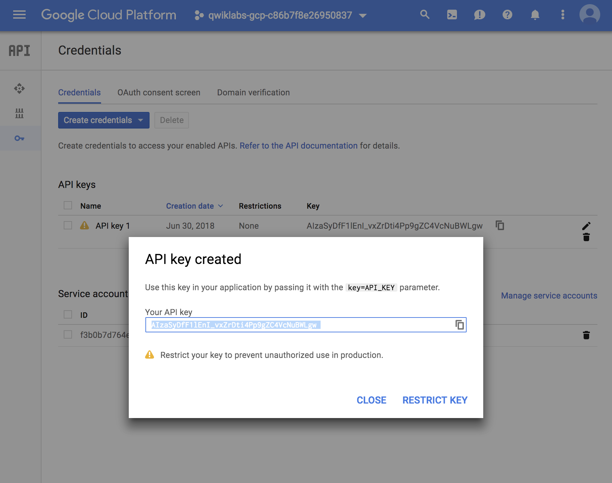

```
datalab create jupyter-lab-training-vm --zone us-west1-a
```

create a notbook and 

```
%bash
git clone https://github.com/GoogleCloudPlatform/training-data-analyst
rm -rf training-data-analyst/.git
```

once clone is done, 

go to `notebooks/datalab/training-data-analyst/courses/machine_learning/deepdive/01_googleml/mlapis.ipynb`

which comes from https://github.com/GoogleCloudPlatform/training-data-analyst/blob/master/CPB100/lab4c/mlapis.ipynb

- go to apis/credentials in google console



Then, Opt + Enter in macOS

```
!pip install --upgrade google-api-python-client
```

google translator api
---------------------

- from en to nep

```
# running Translate API
from googleapiclient.discovery import build
service = build('translate', 'v2', developerKey=APIKEY)

# use the service
inputs = ['is it really this easy?', 'amazing technology', 'wow']
outputs = service.translations().list(source='en', target='nep', q=inputs).execute()
# print outputs
for input, output in zip(inputs, outputs['translations']):
  print u"{0} -> {1}".format(input, output['translatedText'])
```

```
is it really this easy? -> के यो साँच्चै यो सजिलो छ?
amazing technology -> अद्भुत प्रविधि
wow -> वाह
```


google vision api
-------------------

- upload file to google-storage(gs) bucket `traning_data` and make it public

```
# Running Vision API
import base64
IMAGE="gs://traning_data/chinese_text.jpg"
vservice = build('vision', 'v1', developerKey=APIKEY)
request = vservice.images().annotate(body={
        'requests': [{
                'image': {
                    'source': {
                        'gcs_image_uri': IMAGE
                    }
                },
                'features': [{
                    'type': 'TEXT_DETECTION',
                    'maxResults': 3,
                }]
            }],
        })
responses = request.execute(num_retries=3)
print responses
```
